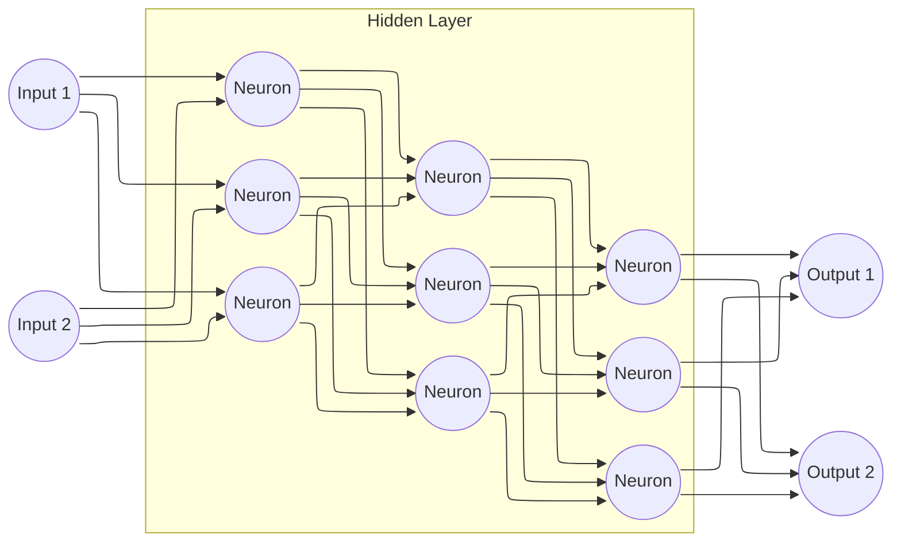
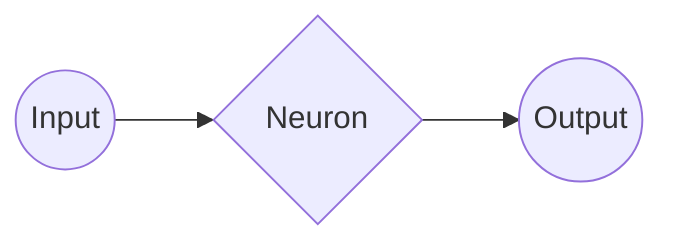

# CONNECT-NN
Connect NN - A simple Python module designed to be used in the development of Artificial Neural Networks

# Development
Connect NN can make custom neural networks, and basic activation functions that can be used in deep learning
 applications

# Making a Artificial Neural Network
First, we have to understand how the ANN works:

This graph can be very confusing, here is a "simplification" of this diagram:

The neuron “thinks” because it carries out a process called **dot**, which multiplies the values ​​in the tables and adds them together. For example, I have two arrays: [1,2,3] and [3,2,1], so I want to apply the **dot** method, the result will be 10, because (1 * 3) + (2 * 2) + (3 * 1) = (3) + (4) + (3) = 3 + 4 + 3 = 10. For dot works, we need to multiply the neuron's inputs by the weight, that is the "memory" of the neuron. We need to use the **dot** method with this two arrays, and we will have the **linear function's output**.

To obtain the final output, the output of the linear function will go through an **activation function**, which will transform it into a readable output, and finaly the ***neuron's output***.
